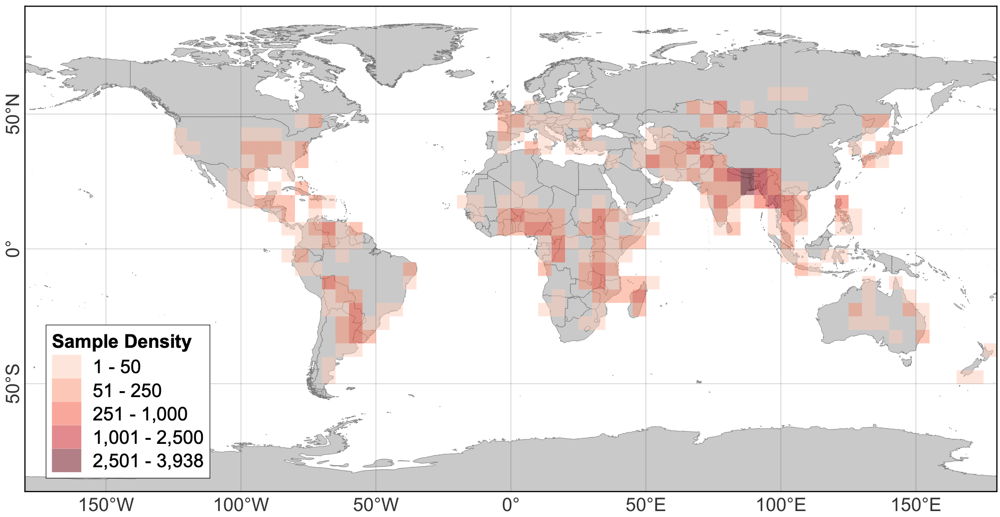

# SenForFlood

A global multi-modeal dataset for flood mapping with images before and during flood.

Paper: [coming up]

DOI: [coming up]

Authors: [geohum.eu](geohum.eu)

## Access

The dataset can be accessed through the following platforms:
 - [Huggingface](https://huggingface.co/datasets/matosak/SenForFlood) (upload in progress)
 - [Harvard Dataverse]() (upload in progress)

## Abstract

> Floods are devastating hazards that cause human displacement, loss of life and damage of properties. Getting accurate information about the extent and severity of floods is essential for planning proper humanitarian emergency assistance. Though integrating earth observation with deep learning models supports rapid information extraction, mapping floods accurately is still a challenging task, because of the necessity of extensive, representative datasets with high quality labels to train models. While there exist some datasets that focus on providing satellite imagery for flood events, these are typically limited to data either from few floods or for specific regions. Moreover, the majority of these datasets provide images captured only during the flood event, which hinders methods that rely on detecting change. Therefore, in this work, we created a global dataset for mapping flood extent (SentForFlood), including images before and during flood from Sentinel-1 and -2, terrain elevation and slope, Land Use and Land Cover (LULC), and flood masks. The samples included in each flood event were selected by analysts considering quality of flood mask and completeness of the available satellite imagery. The dataset incorporated data from over 350 distinct flood events, encompassing all continents except Antarctica. The dataset was tested by training a convolutional neural network for detecting floods without permanent water bodies and the results are discussed. We expect that the dataset will facilitate the development of robust, transferable models for automatic flood mapping, thereby contributing to the humanitarian emergency repose in crisis situations.

## Dataset Information

A total of 353 flood events around the globe were included in the dataset, separated into DFO and CEMS. The samples from DFO possess flood masks created using an automatic change detection algorithm, while samples in CEMS have high-quality, analyst created flood masks from previous emercency activations.

